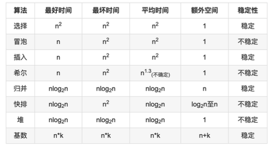

# PLAN

> leetcode: https://leetcode-cn.com/tag/array/
>
> 刷题模版： https://greyireland.gitbook.io/algorithm-pattern/	
>
> repo：https://github.com/labuladong/fucking-algorithm

```
我的方法只适合连数据结构都不扎实的菜鸡选手～不要完全按tag！头一次刷，先把这五个tag做了：array，string，tree，linkedlist，math，其它的千万别按tag刷。这样不存在前面答案说的思维暗示问题，反而帮助巩固数据结构，还可以自己归纳某种数据结构的全部技巧～ 每个tag内部就按照easy-medium-hard的顺序做，这样最开始一天刷10道easy，后面熟了这个数据结构一天也能刷5道难题，不会一开始就卡壳，搞得自己很郁闷。这时候已经100多道了，之后从hard往easy刷！前面虐虐虐，后面一天20道easy爽歪歪，很快就刷完啦！赶快买个会员开始第二遍吧！
```

## **刷题策略**： 

**时间紧迫**：

- 刷题目录：https://github.com/CyC2018/CS-Notes/blob/master/notes/Leetcode%20%E9%A2%98%E8%A7%A3%20-%20%E7%9B%AE%E5%BD%95.md
- 在 [https://leetcode-cn.com/problemset/all/](https://link.zhihu.com/?target=https%3A//leetcode-cn.com/problemset/all/) 页面的右侧。先刷热题 HOT 100，再刷精选 TOP 面试题，之后刷其他的题。

- https://zhuanlan.zhihu.com/p/96883783
- https://www.byteflying.com/archives/1015
- [IDEA配置leetcode插件](https://blog.csdn.net/u010180815/article/details/104728115/)


# 算法思想

## 双指针

| 题目                             | 算法思想 | 正确率 |
| -------------------------------- | -------- | ------ |
| [\#167 有序数组的 Two Sum]()     | 双指针   | 0%     |
| [\#633 两数平方和]()             | 双指针   | 0%     |
| [\#345 反转字符串中的元音字符]() | 双指针   | 0%     |
| [\#680 回文字符串]()             | 双指针   | 0%     |
| [\#88 归并两个有序数组]()        | 双指针   | 0%     |
| [\#141 判断链表是否存在环]()     | 双指针   | 0%     |
| [\#542 最长子序列]()             | 双指针   | 0%     |


## 排序算法



[十大排序算法](https://mp.weixin.qq.com/s/Qf416rfT4pwURpW3aDHuCg)

[排序算法的复杂度、实现和稳定性](https://www.jianshu.com/p/916b15eae350)

## 贪心思想

## 二分查找

## 分治

## 搜索

## 动态规划

## 数学


# 数据结构相关

正确率 > 80% 可移除 👩🏻‍💻

## Array

> https://leetcode-cn.com/tag/array/

| 题目                                                         | 算法思想                  | 正确率 |
| ------------------------------------------------------------ | ------------------------- | ------ |
| [\#26 删除排序数组中的重复项](http://www.silince.cn/2020/07/20/LeetSilinceCode/#26-%E5%88%A0%E9%99%A4%E6%8E%92%E5%BA%8F%E6%95%B0%E7%BB%84%E4%B8%AD%E7%9A%84%E9%87%8D%E5%A4%8D%E9%A1%B9) | 双指针                    | 0%     |
| [\#88 合并两个有序数组](http://www.silince.cn/2020/07/20/LeetSilinceCode/#88-合并两个有序数组) | 双指针                    | 0%     |
| [\#169 多数元素](http://www.silince.cn/2020/07/20/LeetSilinceCode/#169-多数元素) | 哈希表/排序/随机化/投票法 | 0%     |
| [\#674 最长连续递增序列](http://www.silince.cn/2020/07/20/LeetSilinceCode/#674-最长连续递增序列) | 动态规划                  | 0%     |
| [\#1051 高度检查器](http://www.silince.cn/2020/07/20/LeetSilinceCode/#1051-高度检查器) | 桶排序                    | 50%    |
| [\#1160 拼写单词](http://www.silince.cn/2020/07/20/LeetSilinceCode/#1160-拼写单词) | counter方法/HashMap       | 0%     |

## String

## Tree

## HashTable

## Graph


